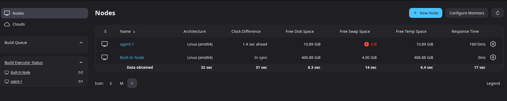
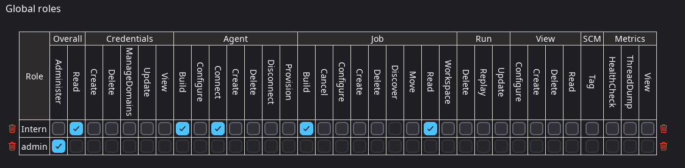

# Week 6: Jenkins (CI/CD) Basics and Advanced Challenge

This repository contains my solutions for the Week 6 Jenkins challenge from the 90DaysOfDevOps program. Each task demonstrates hands-on experience with CI/CD, Jenkins pipelines, agents, security, shared libraries, and monitoring.

---

## Task 1: Create a Jenkins Pipeline Job for CI/CD

### ✅ Completed Task
- Created a new pipeline job in Jenkins
- Developed a `Jenkinsfile` with **Build, Test, and Deploy** stages
- Ran the pipeline successfully and verified logs

### 🔧 Commands Used:
```groovy
pipeline {
    agent any
    stages {
        stage('Build') {
            steps {
                echo 'Building the application...'
            }
        }
        stage('Test') {
            steps {
                echo 'Running tests...'
            }
        }
        stage('Deploy') {
            steps {
                echo 'Deploying application...'
            }
        }
    }
}
```

📄 **Jenkins File:** [Jenkins](Files/Jenkins)

### 🤔 Interview Questions & Answers
**Q: How do declarative pipelines streamline the CI/CD process compared to scripted pipelines?**  
A: Declarative pipelines provide a simpler, more structured syntax, reducing complexity and improving maintainability.

**Q: What are the benefits of breaking the pipeline into distinct stages?**  
A: It improves clarity, debugging, and efficiency by isolating different processes like build, test, and deployment.

---

## Task 2: Build a Multi-Branch Pipeline for a Microservices Application

### ✅ Completed Task
- Configured a multi-branch pipeline to detect branches automatically
- Created parallel execution for multiple services

### 🔧 Commands Used:
```groovy
pipeline {
    agent any
    stages {
        stage('Checkout') {
            steps {
                git branch: 'main', url: 'https://github.com/user/repo.git'
            }
        }
        stage('Build & Test') {
            parallel {
                stage('Service 1') { steps { echo 'Building Service 1' } }
                stage('Service 2') { steps { echo 'Building Service 2' } }
            }
        }
    }
}
```

📄 **Jenkins File:** [Jenkins](Files/Jenkins_multi)

### 🤔 Interview Questions & Answers
**Q: How does a multi-branch pipeline improve continuous integration for microservices?**  
A: It enables independent CI/CD for each microservice, reducing integration bottlenecks.

**Q: What challenges might you face when merging feature branches in a multi-branch pipeline?**  
A: Merge conflicts, inconsistent environments, and dependency misalignments.

---

## Task 3: Configure and Scale Jenkins Agents/Nodes

### ✅ Completed Task
- Configured **two agents** (Linux & Windows)
- Assigned labels to direct jobs to the correct agent

### 🔧 Commands Used:
```sh
docker run -d --name jenkins-agent-linux jenkins/agent
```

### 📸 Screenshot:


### 🤔 Interview Questions & Answers
**Q: What are the benefits of using distributed agents in Jenkins?**  
A: Load balancing, faster builds, and multi-platform support.

**Q: How can you ensure that jobs are assigned to the correct agent?**  
A: By using node labels and specifying `agent { label 'linux' }` in the Jenkinsfile.

---

## Task 4: Implement and Test RBAC in a Multi-Team Environment

### ✅ Completed Task
- Configured **Role-Based Access Control (RBAC)** using the **Matrix-Based Security Plugin**
- Created test accounts for different user roles

### 📸 Screenshot:


### 🤔 Interview Questions & Answers
**Q: Why is RBAC essential in a CI/CD environment?**  
A: It prevents unauthorized access and protects sensitive pipeline configurations.

**Q: What are the consequences of weak access control?**  
A: Unauthorized deployments, security breaches, and accidental data loss.

---

## Task 5: Develop and Integrate a Jenkins Shared Library

### ✅ Completed Task
- Created a **Shared Library** to reuse common functions
- Integrated it into multiple pipelines

### 🔧 Commands Used:
```groovy
@Library('my-shared-library') _
stage('Test') {
    steps {
        mySharedLibrary.testStage()
    }
}
```

📄 **Jenkins File:** [Jenkins](Files/Jenkins_sharedlib)

### 🤔 Interview Questions & Answers
**Q: How do shared libraries contribute to code reuse?**  
A: They eliminate redundancy by centralizing common pipeline functions.

**Q: What type of function is ideal for a shared library?**  
A: Notification, testing, and deployment scripts.

---

## Task 6: Integrate Vulnerability Scanning with Trivy

### ✅ Completed Task
- Integrated **Trivy** vulnerability scanning into the Jenkins pipeline

### 🔧 Commands Used:
```sh
trivy image my-docker-app:v1.0
```

### 📸 Screenshot:


### 🤔 Interview Questions & Answers
**Q: Why is integrating vulnerability scanning important?**  
A: It helps detect and fix security issues before deployment.

**Q: How does Trivy improve Docker security?**  
A: By scanning images for known vulnerabilities in packages and dependencies.

---

## Task 7: Dynamic Pipeline Parameterization

### ✅ Completed Task
- Implemented runtime parameters to **deploy different versions**

### 🔧 Commands Used:
```groovy
parameters {
    string(name: 'TARGET_ENV', defaultValue: 'staging', description: 'Deployment environment')
}
```

### 📸 Screenshot:


### 🤔 Interview Questions & Answers
**Q: How does parameterization improve flexibility?**  
A: It enables dynamic deployments without modifying pipeline code.

---

## Task 8: Integrate Email Notifications for Build Events

### ✅ Completed Task
- Configured email alerts for build status updates

### 🔧 Commands Used:
```groovy
emailext (subject: 'Build Notification', body: 'Build Completed', recipientProviders: [[class: 'DevelopersRecipientProvider']])
```

### 📸 Screenshot:


### 🤔 Interview Questions & Answers
**Q: How would you troubleshoot email notifications failing?**  
A: Check SMTP settings, Jenkins logs, and plugin configurations.

---

## Task 9: Troubleshooting & Monitoring

### ✅ Completed Task
- Debugged a **failed pipeline** and resolved errors

### 🔧 Commands Used:
```sh
docker logs jenkins
```

### 📸 Screenshot:


### 🤔 Interview Questions & Answers
**Q: How do you troubleshoot a failing pipeline?**  
A: Analyze logs, check syntax errors, and use debugging steps.

**Q: What are effective strategies for monitoring Jenkins?**  
A: Use monitoring plugins, system logs, and external tools like Prometheus.

---

### 🎯 Conclusion
This challenge enhanced my **Jenkins CI/CD** expertise and prepared me for real-world DevOps scenarios!


