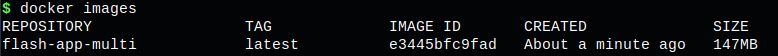

# Week 5: Docker Basics & Advanced Challenge

Welcome to the **Week 5 Docker Challenge!** This repository showcases the completion of all tasks in the challenge. Below are the completed tasks along with their descriptions, commands used, and screenshots.

## Task 1: Introduction and Conceptual Understanding

### Introduction to Docker  
Docker is an open-source platform designed to automate the deployment, scaling, and management of applications. It allows developers to package applications and their dependencies into lightweight, portable containers, ensuring consistency across different environments.

### Virtualization vs. Containerization  

| Feature            | Virtualization                          | Containerization                         |
|--------------------|--------------------------------------|-----------------------------------------|
| **Architecture**   | Uses a hypervisor to create VMs    | Uses a container runtime (e.g., Docker) |
| **Performance**    | Higher overhead due to full OS     | Lightweight, shares the host OS kernel |
| **Boot Time**      | Slow (minutes)                     | Fast (seconds)                         |
| **Resource Usage** | Requires more CPU & RAM           | Efficient resource utilization         |
| **Isolation**      | Stronger (separate OS per VM)     | Process-level isolation                |

### Why Containerization is Preferred for Microservices & CI/CD?  
✅ **Lightweight & Fast** - Containers start quickly and consume fewer resources compared to VMs.  
✅ **Consistency Across Environments** - Ensures that applications run the same way in development, testing, and production.  
✅ **Scalability** - Containers allow for efficient scaling and orchestration using tools like Kubernetes.  
✅ **Microservices Support** - Ideal for breaking applications into smaller, independent services.  
✅ **CI/CD Integration** - Easily integrates with CI/CD pipelines for faster deployment and rollback.  


## Task 2: Create a Dockerfile for a Sample Project

### ✅ Completed Task
- Selected a simple application.
- Created a `Dockerfile`.
- Built and ran the image locally.

### Commands Used:
```sh
docker build -t <your-username>/sample-app:latest .
docker run -d -p 8080:80 <your-username>/sample-app:latest
docker ps
docker logs <container_id>
```

## Task 3: Explore Docker Terminologies and Components

### Key Docker Terminologies  

- **Image**: A lightweight, standalone, and executable package that includes everything needed to run a piece of software, including the code, runtime, libraries, and dependencies.  
- **Container**: A running instance of a Docker image that encapsulates an application and its dependencies.  
- **Dockerfile**: A script containing a set of instructions to automate the creation of Docker images.  
- **Volume**: A mechanism for persisting data outside the container’s filesystem, ensuring data is retained even after a container is removed.  
- **Network**: A way for containers to communicate with each other using Docker’s built-in networking capabilities.  

### Docker Components  

- **Docker Engine**: The core component responsible for running containers.  
- **Docker Hub**: A cloud-based registry where Docker images can be stored and shared.  
- **Docker CLI**: A command-line tool used to interact with Docker, manage images, and run containers.  
- **Container Runtime**: The underlying technology that enables containers to run efficiently, such as `containerd`.  


## Task 4: Optimize Your Docker Image with Multi-Stage Builds

### ✅ Completed Task
- Implemented multi-stage builds.
- Compared image sizes.

### Commands Used:
```sh
docker images
```

. 


## Task 5: Manage Your Image with Docker Hub

### ✅ Completed Task
- Tagged and pushed image to Docker Hub.

### Commands Used:
```sh
docker tag <your-username>/sample-app:latest <your-username>/sample-app:v1.0
docker login
docker push <your-username>/sample-app:v1.0
docker pull <your-username>/sample-app:v1.0
```


## Task 6: Persist Data with Docker Volumes

### ✅ Completed Task
- Created and used a Docker volume.

### Commands Used:
```sh
docker volume create my_volume
docker run -d -v my_volume:/app/data <your-username>/sample-app:v1.0
```


## Task 7: Configure Docker Networking

### ✅ Completed Task
- Created a custom Docker network.
- Connected multiple containers.

### Commands Used:
```sh
docker network create my_network
docker run -d --name sample-app --network my_network <your-username>/sample-app:v1.0
docker run -d --name my-db --network my_network -e MYSQL_ROOT_PASSWORD=root mysql:latest
```


## Task 8: Orchestrate with Docker Compose

### ✅ Completed Task
- Created a `docker-compose.yml` file.
- Deployed services.

### Commands Used:
```sh
docker-compose up -d
docker-compose down
```


## Task 9: Analyze Your Image with Docker Scout

### ✅ Completed Task
- Analyzed image vulnerabilities with Docker Scout.

### Commands Used:
```sh
docker scout cves <your-username>/sample-app:v1.0
docker scout quickview <your-username>/sample-app:v1.0
docker scout cves <your-username>/sample-app:v1.0 > scout_report.txt
```


## Task 10: Documentation and Critical Reflection  

### Commands Executed  
Throughout this challenge, the following key Docker commands were used:  

```sh
# Build and run a Docker container
docker build -t <your-username>/sample-app:latest .
docker run -d -p 8080:80 <your-username>/sample-app:latest

# Verify running containers and logs
docker ps
docker logs <container_id>

# Tag and push image to Docker Hub
docker tag <your-username>/sample-app:latest <your-username>/sample-app:v1.0
docker push <your-username>/sample-app:v1.0

# Work with Docker volumes
docker volume create my_volume
docker run -d -v my_volume:/app/data <your-username>/sample-app:v1.0

# Manage Docker networking
docker network create my_network
docker run -d --name sample-app --network my_network <your-username>/sample-app:v1.0
docker run -d --name my-db --network my_network -e MYSQL_ROOT_PASSWORD=root mysql:latest

# Deploy using Docker Compose
docker-compose up -d
docker-compose down

# Analyze security with Docker Scout
docker scout cves <your-username>/sample-app:v1.0 > scout_report.txt
```


---
## 🎯 Conclusion
This challenge provided hands-on experience with Docker’s essential and advanced features. It covered everything from building images, networking, and data persistence to container orchestration and security analysis.
