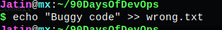
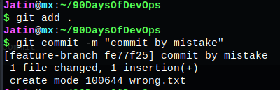
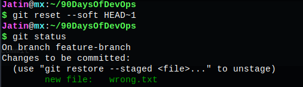
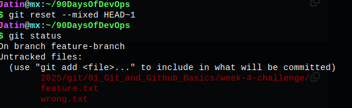
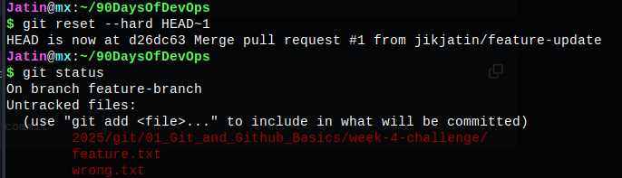
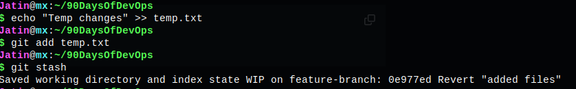
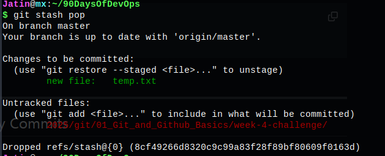
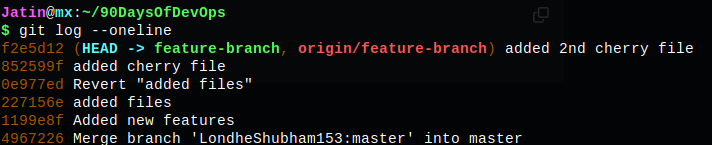
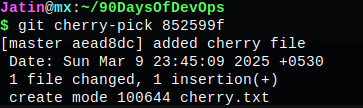
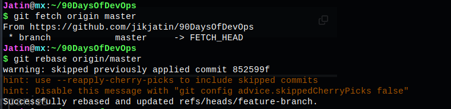

# Week 4: Git & GitHub Advanced Challenge

This challenge covers advanced Git concepts essential for real-world DevOps workflows. Below are the tasks completed with step-by-step execution and relevant Git commands.

## Task 1: Working with Pull Requests (PRs)

- Forked the repository and cloned it locally:
  ```sh
  git clone <your-forked-repo-url>
  cd <repo-name>
  ```
- Created a feature branch and made changes:
  ```sh
  git checkout -b feature-branch
  echo "New Feature" >> feature.txt
  git add .
  git commit -m "Added a new feature"
  ```
- Pushed the changes and created a Pull Request:
  ```sh
  git push origin feature-branch
  ```
- Merged the PR after review.


---

## Task 2: Undoing Changes – Reset & Revert

- Created and modified a file:
  ```sh
  echo "Wrong code" >> wrong.txt
  git add .
  git commit -m "Committed by mistake"
  ```
- Used reset and revert to undo changes:
  ```sh
  git reset --soft HEAD~1   # Keeps changes staged
  git reset --mixed HEAD~1  # Unstages changes
  git reset --hard HEAD~1   # Removes all changes
  git revert HEAD           # Safely reverts last commit
  ```

  
  
  
  
  


---

## Task 3: Stashing - Save Work Without Committing

- Modified a file without committing:
  ```sh
  echo "Temporary Change" >> temp.txt
  git add temp.txt
  ```
- Stashed the changes and reapplied them:
  ```sh
  git stash
  git checkout main
  git stash pop
  ```

  


---

## Task 4: Cherry-Picking - Selectively Apply Commits

- Found the commit to cherry-pick:
  ```sh
  git log --oneline
  ```
- Applied a specific commit to the current branch:
  ```sh
  git cherry-pick <commit-hash>
  ```
- Resolved conflicts if any:
  ```sh
  git cherry-pick --continue
  ```

  


---

## Task 5: Rebasing - Keeping a Clean Commit History

- Fetched the latest changes and rebased:
  ```sh
  git fetch origin main
  git rebase origin/main
  ```
- Resolved conflicts and continued rebase:
  ```sh
  git rebase --continue
  ```



---

## Task 6: Branching Strategies Used in Companies

- Simulated different Git workflows:
  ```sh
  git branch feature-1
  git branch hotfix-1
  git checkout feature-1
  ```
- Explored Git branching strategies:
  - **Git Flow** (Feature, Release, Hotfix branches)
  - **GitHub Flow** (Main + Feature branches)
  - **Trunk-Based Development** (Continuous Integration)

---

## Summary

This challenge covered advanced Git operations, including Pull Requests, Reset & Revert, Stashing, Cherry-Picking, Rebasing, and real-world Git workflows. Screenshots demonstrate the execution of each task. 🎯
