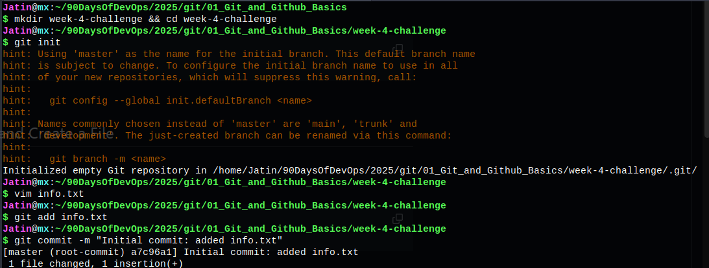
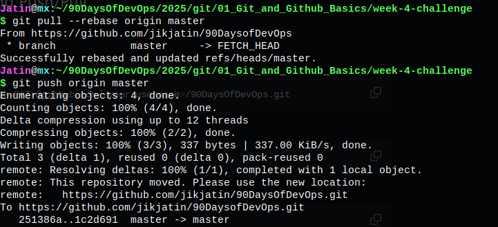
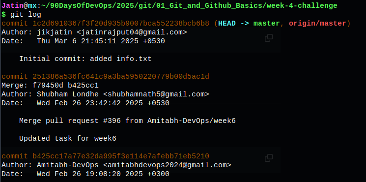
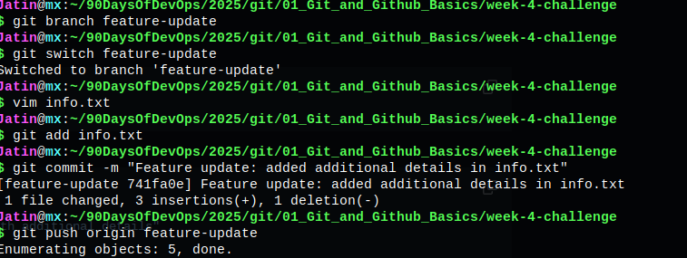

# Git and GitHub Challenge - Week 4

## Overview
This repository contains solutions for the Week 4 Git and GitHub Challenge, where I practiced essential Git and GitHub commands. The tasks include repository management, branching, authentication, and exploring commit history.

---

## Tasks Completed

### Task 1: Fork and Clone the Repository
- Forked the repository on GitHub.
- Cloned the forked repository using HTTPS.
- Navigated into the cloned directory.

```sh
git clone <your-fork-url>
cd 2025/git/01_Git_and_Github_Basics
```


---

### Task 2: Initialize a Local Repository and Create a File
- Created a new directory for the challenge.
- Initialized a new Git repository.
- Created an `info.txt` file and added initial content.
- Staged and committed the file.

```sh
mkdir week-4-challenge
cd week-4-challenge
git init
echo "My Name - DevOps Enthusiast" > info.txt
git add info.txt
git commit -m "Initial commit: Add info.txt with introductory content"
```



---

### Task 3: Configure Remote URL with PAT and Push/Pull
- Configured remote URL using a Personal Access Token (PAT).
- Pushed the commit to the remote repository.
- Pulled changes from the remote repository.

```sh
git remote add origin https://<your-username>:<your-PAT>@github.com/<your-username>/90DaysOfDevOps.git
git push -u origin main
git pull origin main
```



---

### Task 4: Explore Your Commit History
- Used `git log` to view commit history and noted commit hashes.

```sh
git log
```



---

### Task 5: Advanced Branching and Switching
- Created a new branch `feature-update`.
- Switched to the new branch and modified `info.txt`.
- Staged and committed the changes.
- Pushed the branch to the remote repository.

```sh
git branch feature-update
git switch feature-update
echo "Adding more details to info.txt" >> info.txt
git add info.txt
git commit -m "Feature update: Enhance info.txt with additional details"
git push origin feature-update
```



---

### Task 6: Explain Branching Strategies
- Documented Git commands used in previous tasks.
- Explained the importance of branching strategies in collaborative development:
  - Isolating features and bug fixes
  - Facilitating parallel development
  - Reducing merge conflicts
  - Enabling effective code reviews


---

### Bonus Task: Explore SSH Authentication
- Generated an SSH key and added it to GitHub.
- Switched the remote URL from HTTPS to SSH.
- Tested SSH connection by pushing changes.

```sh
ssh-keygen
cat ~/.ssh/id_ed25519.pub # Copy this key to GitHub

git remote set-url origin git@github.com:<your-username>/90DaysOfDevOps.git
git push origin feature-update
```


---

## Conclusion
Successfully completed the Git and GitHub challenge by performing repository management, branching, authentication, and commit history exploration. 🚀
