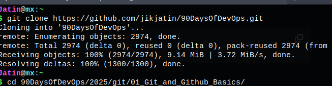

# Git and GitHub Challenge - Week 4

Welcome to the Week 4 Git and GitHub Challenge! This repository contains all the tasks completed as part of the challenge, showcasing essential Git and GitHub commands and workflows.

## Tasks Completed

### Task 1: Fork and Clone the Repository
- Forked the repository to my GitHub account.
- Cloned the forked repository using:
  ```sh
  git clone <your-fork-url>
  ```
- Navigated into the cloned repository:
  ```sh
  cd 2025/git/01_Git_and_Github_Basics
  ```

**Image Placeholder:** `

---

### Task 2: Initialize a Local Repository and Create a File
- Created a new directory for the challenge:
  ```sh
  mkdir week-4-challenge
  cd week-4-challenge
  ```
- Initialized the directory as a Git repository:
  ```sh
  git init
  ```
- Created a file `info.txt` with some initial content.
- Staged and committed the file:
  ```sh
  git add info.txt
  git commit -m "Initial commit: Add info.txt with introductory content"
  ```

**Image Placeholder:** ``

---

### Task 3: Configure Remote URL with PAT and Push/Pull
- Configured remote URL with a Personal Access Token (PAT):
  ```sh
  git remote add origin https://<your-username>:<your-PAT>@github.com/<your-username>/90DaysOfDevOps.git
  ```
- Pushed the changes to the remote repository:
  ```sh
  git push -u origin main
  ```
- Pulled remote changes:
  ```sh
  git pull origin main
  ```

**Image Placeholder:** ``

---

### Task 4: Explore Commit History
- Viewed commit history using:
  ```sh
  git log
  ```

**Image Placeholder:** ``

---

### Task 5: Advanced Branching and Switching
- Created a new branch `feature-update`:
  ```sh
  git branch feature-update
  ```
- Switched to the new branch:
  ```sh
  git switch feature-update
  ```
- Modified `info.txt` and committed the changes:
  ```sh
  git add info.txt
  git commit -m "Feature update: Enhance info.txt with additional details"
  ```
- Pushed the branch to the remote repository:
  ```sh
  git push origin feature-update
  ```

**Image Placeholder:** ``

---

### Task 6: Explain Branching Strategies
- Documented all Git commands used.
- Explained the importance of branching strategies in collaborative development:
  - Isolating features and bug fixes.
  - Facilitating parallel development.
  - Reducing merge conflicts.
  - Enabling effective code reviews.

**Image Placeholder:** ``

---

### Bonus Task: Explore SSH Authentication
- Generated an SSH key pair using:
  ```sh
  ssh-keygen
  ```
- Added the SSH key to GitHub.
- Changed the remote URL to use SSH:
  ```sh
  git remote set-url origin git@github.com:<your-username>/90DaysOfDevOps.git
  ```
- Pushed a branch using SSH:
  ```sh
  git push origin feature-update
  ```

**Image Placeholder:** ``

---

## Notes
- Each task is well-documented and includes the corresponding Git commands used.
- Placeholder images are provided (`images/taskX.png`). Replace these with actual screenshots.

Feel free to contribute or suggest improvements! 🚀
