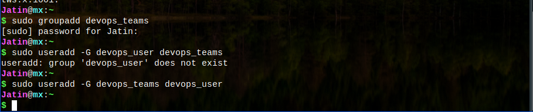
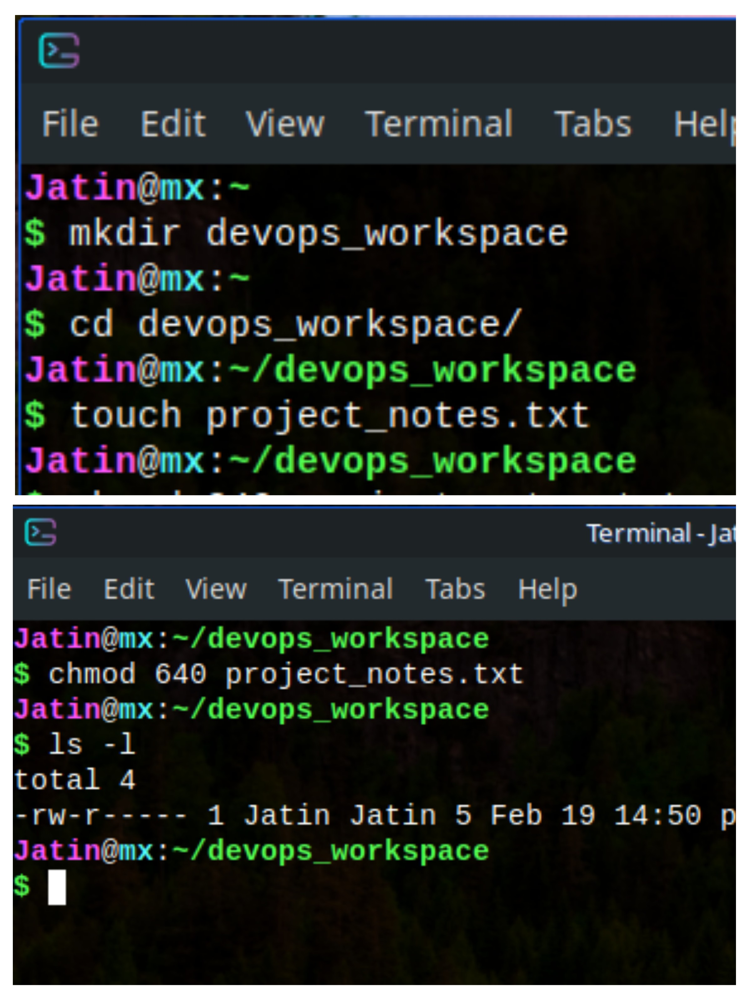
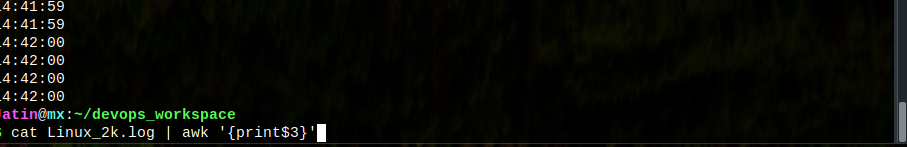

# DevOps Linux Tasks

This repository contains hands-on DevOps tasks focused on Linux system administration, user management, log analysis, volume management, and automation.

## 📌 Tasks Overview

### 1️⃣ User & Group Management
**Objective:** Learn about Linux users, groups, and permissions.

#### Steps:
- Created user `devops_user` and added them to `devops_team`.
- Set a password and granted `sudo` access.
- Restricted SSH login for certain users via `/etc/ssh/sshd_config`.

📷 **Screenshot:** 

---

### 2️⃣ File & Directory Permissions
**Objective:** Set appropriate permissions for files and directories.

#### Steps:
- Created `/devops_workspace` and `project_notes.txt`.
- Set permissions: Owner can edit, group can read, others have no access.
- Verified using `ls -l`.

📷 **Screenshot:** 

---

### 3️⃣ Log File Analysis with AWK, Grep & Sed
**Objective:** Analyze logs using `Linux_2k.log`.

#### Steps:
- Downloaded the log file from the repository.
- Extracted insights using:
  - `grep` to find occurrences of "error".
  - `awk` to extract timestamps and log levels.
  - `sed` to replace IP addresses with `[REDACTED]`.
- Found the most frequent log entry using `awk` and `sort | uniq -c | sort -nr | head -10`.

📷 **Screenshot:** 

---

### 4️⃣ Volume Management & Disk Usage
**Objective:** Mount a new volume and verify disk usage.

#### Steps:
- Created `/mnt/devops_data`.
- Mounted a new volume (or loop device for local practice).
- Verified using `df -h` and `mount | grep devops_data`.

📷 **Screenshot:** 

---

### 5️⃣ Process Management & Monitoring
**Objective:** Monitor and manage system processes.

#### Steps:
- Started a background process (`ping google.com > ping_test.log &`).
- Used `ps`, `top`, and `htop` to monitor it.
- Killed the process and verified it’s gone.

📷 **Screenshot:** 

---

### 6️⃣ Automate Backups with Shell Scripting
**Objective:** Automate backups using a shell script and cron jobs.

#### Steps:
- Wrote a script to back up `/devops_workspace` as `backup_$(date +%F).tar.gz`.
- Saved it in `/backups` and scheduled it using `cron`.
- Displayed a success message in green text using `echo -e`.

📷 **Screenshot:** 

---

## 🚀 How to Use This Repository
1. Clone the repository:  
   ```bash
   git clone https://github.com/jikjatin/90DaysOfDevOpsChallenge/tree/main/Linux
   ```
2. Follow the steps mentioned in each task directory.

## 🛠 Technologies Used
- Linux
- Bash Scripting
- SSH, Sudo, Permissions
- AWK, Grep, Sed
- Volume Management
- Process Monitoring

## 📜 License
This project is licensed under the MIT License.

---
Feel free to contribute by adding improvements or new tasks!

