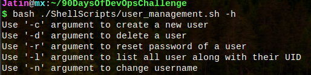
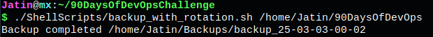
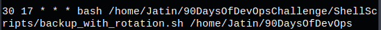

# Bash Scripting Challenges

This repository contains solutions for two Bash scripting challenges:
1. **User Account Management**
2. **Automated Backup & Recovery using Cron**

Each challenge includes the corresponding script file, explanations, and example usage.

---

## 🚀 Challenge 1: User Account Management
**Objective:** Create a Bash script (`user_management.sh`) that provides options for managing user accounts on the system.

### Features:
- **Create a user:** `-c` or `--create`
- **Delete a user:** `-d` or `--delete`
- **Reset password:** `-r` or `--reset`
- **List user accounts:** `-l` or `--list`
- **Help section:** `-h` or `--help`

### 📷 **Example Usage:**  


📄 **Script File:** [user_management.sh](./user_management.sh)


---

## 🔄 Challenge 2: Automated Backup & Recovery using Cron
**Objective:** Create a Bash script (`backup_with_rotation.sh`) that performs automated backups with a rotation mechanism to retain the last 3 backups.

### Features:
- **Takes a directory path as an argument**
- **Creates timestamped backup folders**
- **Retains only the last 3 backups, deleting older ones**

### Example Usage:  


After multiple executions, only the last 3 backups are retained.  

### 📷 **Crontab setup:**  
  
The script will run at 17:30 every day.  

📄 **Script File:** [backup_with_rotation.sh](./backup_with_rotation.sh)  

---

## 📜 How to Use
1. **Clone this repository:**
   ```bash
   git clone https://github.com/jikjatin/90DaysOfDevOpsChallenge.git
   cd ShellScripts
   ```
2. **Grant execution permissions:**
   ```bash
   chmod +x user_management.sh
   chmod +x backup_with_rotation.sh
   ```
3. **Run the scripts with appropriate arguments.**

## 🛠 Technologies Used
- Bash Scripting
- Linux User Management (`useradd`, `passwd`, `deluser`, etc.)
- File Management (`cp`, `rm`, `ls`, etc.)
- Cron Jobs for Automation

## 📜 License
This project is licensed under the MIT License.

---

Feel free to contribute by suggesting improvements or adding new challenges! 🚀

